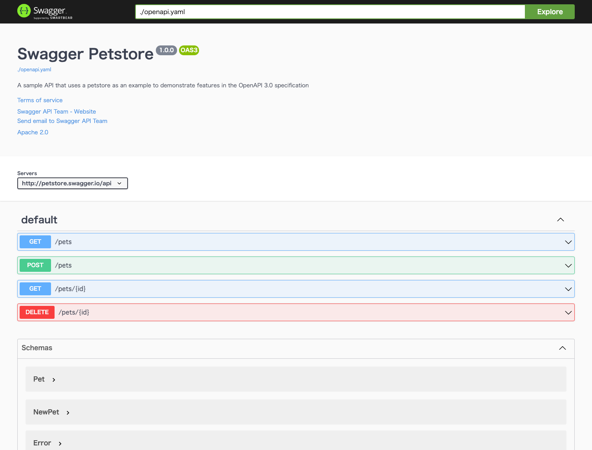

# openapi-ecosystem
This project will introduce an ecosystem around the OpenAPI specification and various tools.

## build-api-spec
Builds a single OpenAPI specification from multiple, separate definition files.

```bash
$ make build-api-spec
docker-compose run --rm swagger-cli swagger-cli bundle -t yaml -o ./dist/openapi.yaml ./src/index.yaml
Created dist/openapi.yaml from ./src/index.yaml
```

## open-api-spec
Refer to the built OpenAPI specification with Swagger-UI.

```bash
$ make open-api-spec
docker-compose run --rm swagger-cli swagger-cli bundle -t yaml -o ./dist/openapi.yaml ./src/index.yaml
Created dist/openapi.yaml from ./src/index.yaml
docker-compose up swagger-ui
[+] Running 1/0
 ⠿ Container openapi-echo-system-swagger-ui-1  Created                                                                                                                                                                                                                                                           0.0s
Attaching to openapi-echo-system-swagger-ui-1
```

If you go to http://localhost:8080, you can see the specification on the Swagger-UI, as follows



## generate-api-client
The API client can be generated automatically according to the OpenAPI specification.  
The following command can be used to generate a TypeScript-based client.

```bash
$ make generate-api-client
docker-compose run --rm swagger-cli swagger-cli bundle -t yaml -o ./dist/openapi.yaml ./src/index.yaml
Created dist/openapi.yaml from ./src/index.yaml
docker-compose run --rm openapi-generator generate -i /openapi/openapi/dist/openapi.yaml -g typescript-axios -o /openapi/client/typescript-axios
[main] INFO  o.o.codegen.DefaultGenerator - Generating with dryRun=false
[main] INFO  o.o.codegen.DefaultGenerator - OpenAPI Generator: typescript-axios (client)
[main] INFO  o.o.codegen.DefaultGenerator - Generator 'typescript-axios' is considered stable.
[main] INFO  o.o.c.l.AbstractTypeScriptClientCodegen - Hint: Environment variable 'TS_POST_PROCESS_FILE' (optional) not defined. E.g. to format the source code, please try 'export TS_POST_PROCESS_FILE="/usr/local/bin/prettier --write"' (Linux/Mac)
[main] INFO  o.o.c.l.AbstractTypeScriptClientCodegen - Note: To enable file post-processing, 'enablePostProcessFile' must be set to `true` (--enable-post-process-file for CLI).
[main] WARN  o.o.c.l.AbstractTypeScriptClientCodegen - Error (model name matches existing language type) cannot be used as a model name. Renamed to ModelError
[main] WARN  o.o.c.l.AbstractTypeScriptClientCodegen - Error (model name matches existing language type) cannot be used as a model name. Renamed to ModelError
[main] WARN  o.o.c.l.AbstractTypeScriptClientCodegen - Error (model name matches existing language type) cannot be used as a model name. Renamed to ModelError
[main] WARN  o.o.c.l.AbstractTypeScriptClientCodegen - Error (model name matches existing language type) cannot be used as a model name. Renamed to ModelError
[main] WARN  o.o.c.l.AbstractTypeScriptClientCodegen - Error (model name matches existing language type) cannot be used as a model name. Renamed to ModelError
[main] WARN  o.o.c.l.AbstractTypeScriptClientCodegen - Error (model name matches existing language type) cannot be used as a model name. Renamed to ModelError
[main] WARN  o.o.c.l.AbstractTypeScriptClientCodegen - Error (model name matches existing language type) cannot be used as a model name. Renamed to ModelError
[main] WARN  o.o.c.l.AbstractTypeScriptClientCodegen - Error (model name matches existing language type) cannot be used as a model name. Renamed to ModelError
[main] WARN  o.o.c.l.AbstractTypeScriptClientCodegen - Error (model name matches existing language type) cannot be used as a model name. Renamed to ModelError
[main] INFO  o.o.codegen.TemplateManager - writing file /openapi/client/typescript-axios/index.ts
[main] INFO  o.o.codegen.TemplateManager - writing file /openapi/client/typescript-axios/base.ts
[main] INFO  o.o.codegen.TemplateManager - writing file /openapi/client/typescript-axios/common.ts
[main] INFO  o.o.codegen.TemplateManager - writing file /openapi/client/typescript-axios/api.ts
[main] INFO  o.o.codegen.TemplateManager - writing file /openapi/client/typescript-axios/configuration.ts
[main] INFO  o.o.codegen.TemplateManager - writing file /openapi/client/typescript-axios/git_push.sh
[main] INFO  o.o.codegen.TemplateManager - writing file /openapi/client/typescript-axios/.gitignore
[main] INFO  o.o.codegen.TemplateManager - writing file /openapi/client/typescript-axios/.npmignore
[main] INFO  o.o.codegen.TemplateManager - Skipped /openapi/client/typescript-axios/.openapi-generator-ignore (Skipped by supportingFiles options supplied by user.)
[main] INFO  o.o.codegen.TemplateManager - writing file /openapi/client/typescript-axios/.openapi-generator/VERSION
[main] INFO  o.o.codegen.TemplateManager - writing file /openapi/client/typescript-axios/.openapi-generator/FILES
################################################################################
# Thanks for using OpenAPI Generator.                                          #
# Please consider donation to help us maintain this project 🙏                 #
# https://opencollective.com/openapi_generator/donate                          #
################################################################################
```

## run-mock-api
You can mock an API server according to the OpenAPI specification.
You can mock the API server with the following command.

```bash
$ make run-mock-api
docker-compose run --rm swagger-cli swagger-cli bundle -t yaml -o ./dist/openapi.yaml ./src/index.yaml
Created dist/openapi.yaml from ./src/index.yaml
docker-compose up prism
[+] Running 1/0
 ⠿ Container openapi-echo-system-prism-1  Created                                                                                                                                                                                                                                                                0.0s
Attaching to openapi-echo-system-prism-1
openapi-echo-system-prism-1  | [12:03:37 PM] › [CLI] …  awaiting  Starting Prism…
openapi-echo-system-prism-1  | [12:03:39 PM] › [CLI] ℹ  info      GET        http://0.0.0.0:4010/pets?tags=numquam,officia,sunt,ut,numquam,reiciendis,ut,sint,corrupti,quia,nobis,sed,ipsam,dolor,dignissimos,quis,id,nam,laudantium,sit&limit=759244094
openapi-echo-system-prism-1  | [12:03:39 PM] › [CLI] ℹ  info      POST       http://0.0.0.0:4010/pets
openapi-echo-system-prism-1  | [12:03:39 PM] › [CLI] ℹ  info      GET        http://0.0.0.0:4010/pets/3031764273778045000
openapi-echo-system-prism-1  | [12:03:39 PM] › [CLI] ℹ  info      DELETE     http://0.0.0.0:4010/pets/-8597424204088959000
openapi-echo-system-prism-1  | [12:03:39 PM] › [CLI] ▶  start     Prism is listening on http://0.0.0.0:4010
```

When you access each endpoint of http://localhost:4010, the response will be returned according to the example in the OpenAPI specification.
The following is an example.

```bash
$ curl -s http://localhost:4010/pets | jq .
[
  {
    "id": 1234,
    "name": "doggie",
    "tag": "string"
  },
  {
    "id": 1235,
    "name": "doggie",
    "tag": "string"
  },
  {
    "id": 1236,
    "name": "test",
    "tag": "string"
  }
]
```
